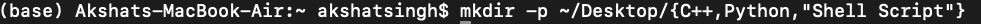

# LA_LAB-1
Step 1 Create Folders Run the following command to create three folders: C++, Python, and Shell Script: mkdir -p ~/Desktop/C++ ~/Desktop/Python ~/Desktop/Shell\ Script Install C++ Compiler and Python

